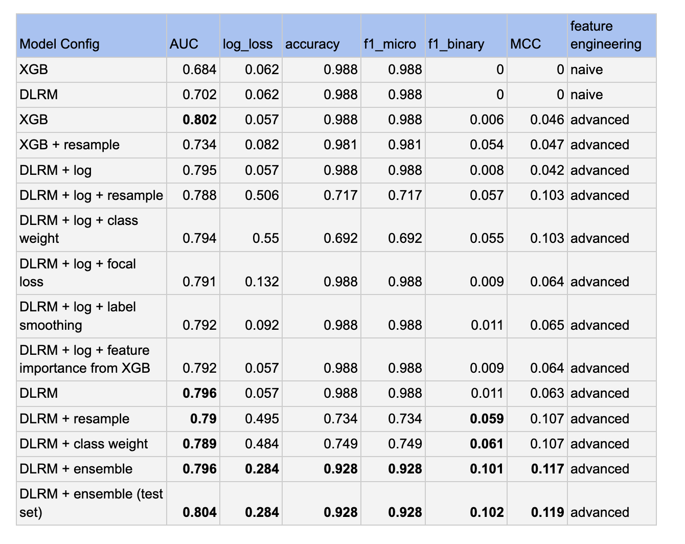

# Project: Install Probability Prediction

## Overview
The repository contains my implementation to develop deep learning models to predict install probability for real-time bidding (RTB).

## Prediction results on the internal valid and internal test sets. 

---
**NOTE**

* 60% of the data in train_data.csv is used as the train set. 

* 20% of the data in train_data.csv is used as the internal valid set.

* 20% of the data in train_data.csv is used as the internal test set.

The results in this table are the prediction results on the internal valid set. 
The best-performed model from the internal valid set is evaluated with the test set (as shown in the last row of the table)

---




## 1. How to set up the pipeline?

Note: This python repository is developed under python 3.8 and tensorflow 2.8 with cpu only. 
However, the code is implemented in such a way that it can automatically detect machine devices (CPU or GPU-enabled).
If tensorflow with GPU is properly set, the models can run using GPU.

* step 1: Navigate to the root directory of the repo where `requirements.txt` and `execute_pipeline.py` can be found.

* step 2: Create a new folder named `data` and put the `train_data.csv` and `assessment_data.csv` there.

* step 3: pip install -r requirements.txt

## 2. How to run the pipeline?

* step 1: Navigate to the root directory of the repo where `requirements.txt` and `execute_pipeline.py` can be found.

* step 2: Run `python execute_pipeline.py`

### About the pipeline

The following instructions show how to launch the full ML pipeline consisting of the following steps:
* Data preprocessing
* Model building and training
* Model evaluation
* Final submission file generation

### Option 1: To start from data preprocessing

```bash
1. Leave `IS_PREPROCESS` to `True` and  `IS_TRAIN` to `True` inside `execute_pipeline.py` 
2. python execute_pipeline.py 
```

In this option, the whole pipeline will start from scratch, which would generate features, train models on the features, evaluate the models on the internal valid set and internal test set, and finally make predictions on the assessment set. 

During this process, the following two sets of features would be generated, trained, and evaluated.

1. basic feature encoding
2. a more advanced feature encoding.


### Option 2: To start with model training

```bash
1. Change `IS_PREPROCESS` to `False` inside `execute_pipeline.py` 
2. python execute_pipeline.py 
```

In this option, the program will skip the feature generation step. 
Instead, the program assumes the training feature files are available in the expected location. It will train models on the features, evaluate the models on the internal valid set and internal test set, and finally make predictions on the assessment set. 

### Option 3: To evaluate and generate submissions with the trained models

```bash
1. change `IS_PREPROCESS` to `False` inside `execute_pipeline.py` 
2. change `IS_TRAIN` to `False` inside `execute_pipeline.py` 
3. python execute_pipeline.py 
```
In this option, the program assumes that the features are generated and the trained weights are saved in the expected folders.
The model weights will be loaded and be evaluated with the internal valid set and internal test set, and finally make predictions on the assessment set

## 3. How is the repo organized?

The `execute_pipeline.py`, which locates at the root directory level, is the main entrypoint. It can be launched via `python execute_pipeline.py` to trigger the 
whole ML pipeline.

There are 5 subfolders:

* `a_preprocessing` contains all files used for performing feature engineering.
  `naive_preprocessor.py` implements basic data preprocessing while `explore_preprocessor.py` performs 
  more advanced data exploration and feature engineering.
  
* `b_models` contains all model implementations including a XGBoost baseline classifier and a DLRM deep learning model.
  
* `c_ensemble` contains utility functions to combine predictions from multiple models into a sinlge prediction.
  
* `d_autoencoder_experiment` contains an experimental script that shows the idea of using an autoencoder to convert the install prediction task to an anomaly detection task. This is a working-in-progress due to the limited time and can be revived in the future. To run the code, please 
  make sure that the advanced data preprocessor has generated feature files to the expected locations, then navigate to
  `d_autoencoder_experiment` and then launch `python autoencoder_exp.py`. 
  
* `metrics`: contains all utility functions for metrics.
